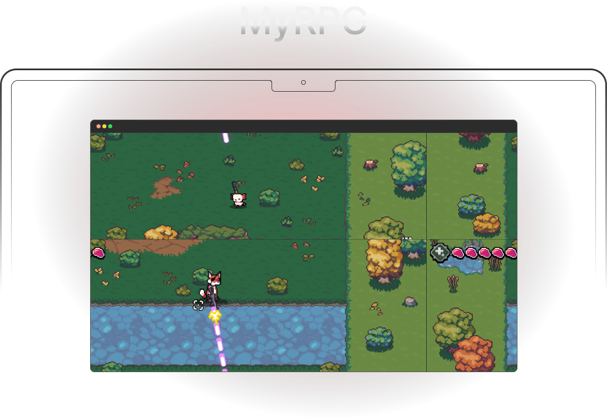
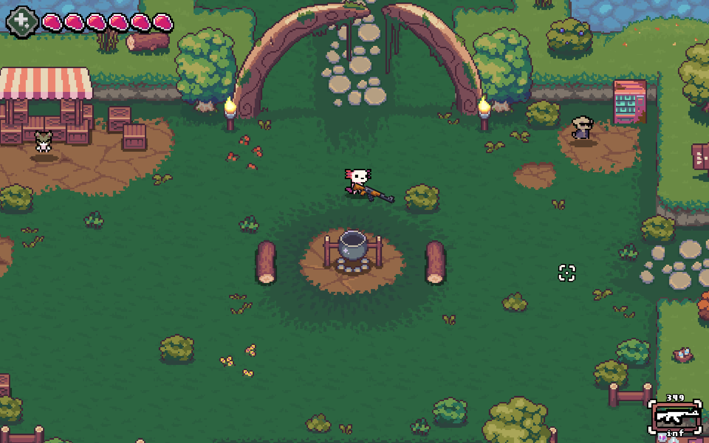
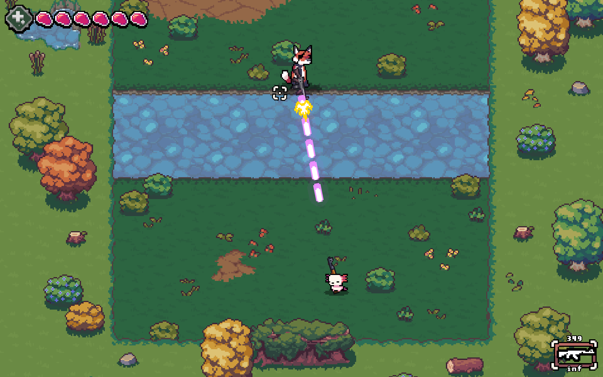
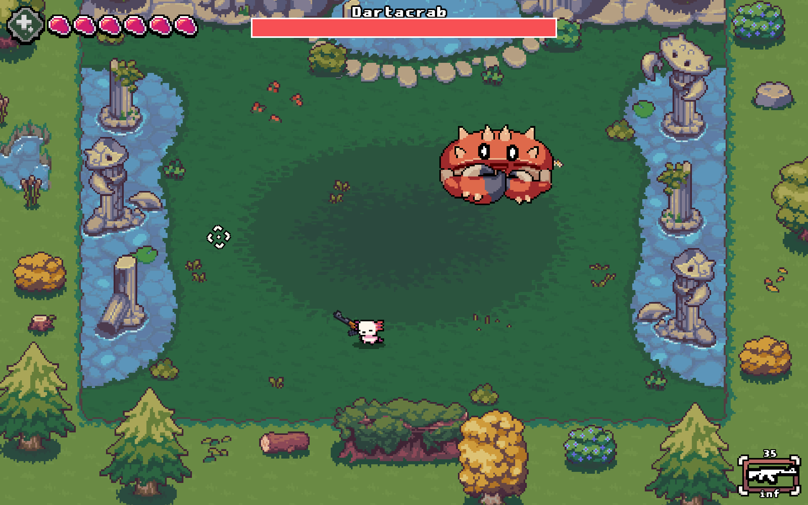
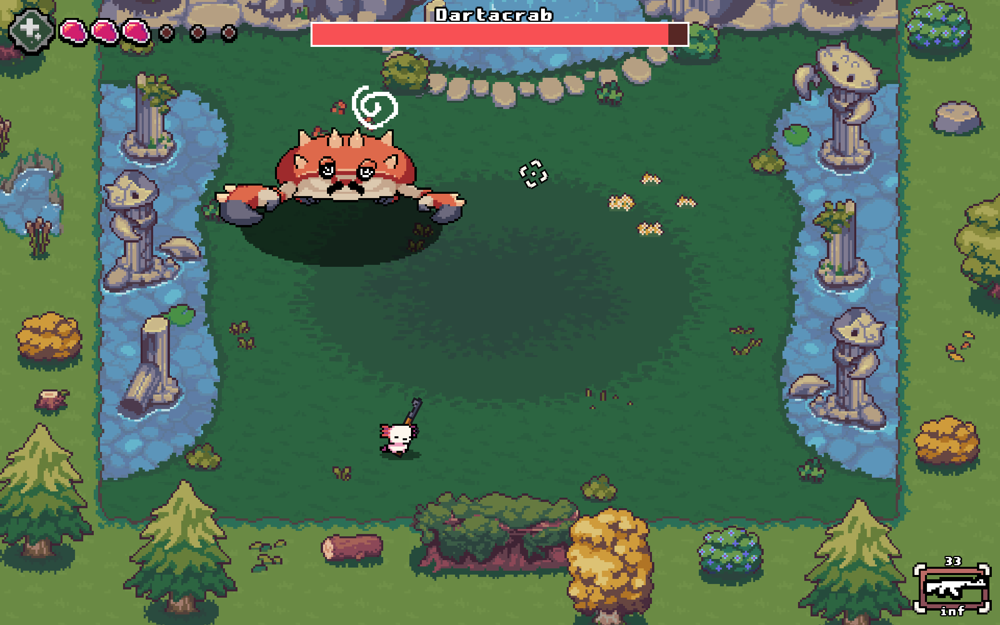
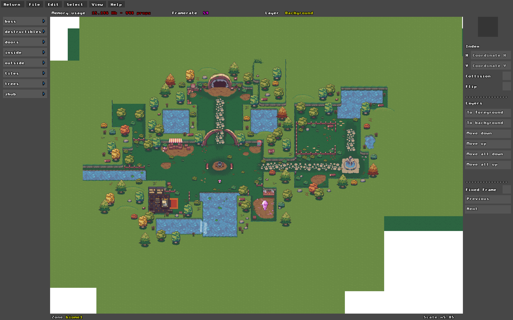
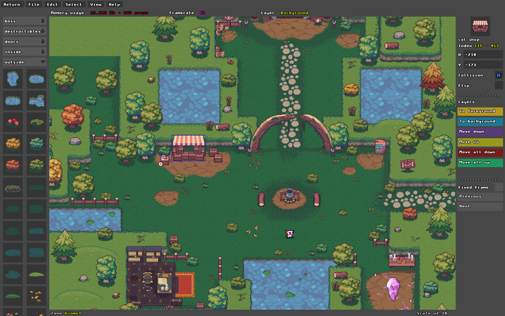

# [@mallory-scotton](https://github.com/mallory-scotton)/my_rpg

**Table of content**  
[Overview](#overview)  
┕ [Disclaimer and Credits](#disclaimer-and-credits)  
┕ [Gallery](#gallery)  
┕ [The Project](#the-project)  
┕ [Getting Started](#getting-started)  
┕ [Prerequisites](#prerequisites)  
┕ [Building the Game](#building-the-game)  
[Architecture](#architecture)  
┕ [Engine](#engine)  
┕ [Editor](#editor)  
┕ [Saves](#saves)  
[Documentation](#documentation)  
[Contact](#contact)  

## Overview

`my_rpg` is a feature-rich, 2D dungeon crawler RPG developed entirely in C using the CSFML library.
Created over 6 weeks by a team of 4 first-year Epitech students, this project represents the
culmination of our foundational graphics and system programming curriculum.

Inspired by the fast-paced, rogue-lite action of [_AK-xolotl_](https://www.akxolotl.com), players
are dropped into dangerous dungeons where they must fight enemies, interact with NPCs, collect loot,
and manage their stats to survive from the beginning to a defined endgame.

Beyond the gameplay, the true challenge of `my_rpg` lies in its underlying architecture. Bound by
strict standard library limitations (no unauthorized functions), we built a custom, data-driven game
engine from scratch. This includes a frame-rate independent animation system, advanced shape-based
collision detection, and a dynamic particle engine, all meticulously optimized to keep the entire
repository, assets included, strictly under 30MB. See [The Project](#the-project) for a detailed
breakdown of the technical requirements and objectives.

### Disclaimer and Credits

This project was created strictly for educational purposes as part of the first-year curriculum
at Epitech.

#### Visual Assets & Inspiration

The visual assets (sprites, environments, UI) used in this project are ripped from/inspired by
the game [AK-xolotl](https://www.akxolotl.com).

- **Original Developers:** 2Awesome Studio
- **Publisher:** Playstack

> We do not own the rights to these visual assets, nor do we claim any ownership over them. This
> project is non-commercial, and no profit will be made from it. All code related to the game
> engine, physics, and logic using CSFML was written entirely by our team.

### Gallery

> The main level of the game is a hub where the player can talk to NPCs, access the player
> inventory, and access the dungeons.



> Once inside a dungeon, the player can fight enemies and bosses using various skills and weapons.
> The player can also find loot and treasures in the dungeons.





> During development, the game can be played in a debug mode that allows the player to test the game
> and its features. The debug mode can be activated by passing a `--debug` argument when launching
> the game. The debug mode allows the player to have more information about the game, like the
> player position, the enemy position, and the collision boxes.

https://github.com/user-attachments/assets/43d1a0db-5de2-4792-aadb-ede543d09e49

> The game comes with a level editor that allows the player to create their own levels and dungeons.
> The editor can even be used to modify the existing levels of the game, like the hub and the
> dungeons. The editor is a powerful tool that allows the player to create their own unique levels
> and share them with others.




https://github.com/user-attachments/assets/4cf4996c-af79-4393-970b-2b1e84e73bf7

### The Project

#### Objectives

- **Language**: `C`
- **Compilation**: `Makefile`
- **Allowed functions**: `malloc`, `free`, `memset`, `(s)rand`, `getline`, `(f)open`, `(f)close`,
  `(f)read`, `(f)write`, `opendir`, `readdir`, `closedir`, all
  [`CSFML`](https://www.sfml-dev.org/fr/download/csfml/) functions, all `math.h` functions
- **Deadline**: 6 weeks
- **Group Size**: 4 members

#### Mandatory

The following features are **mandatory** (if your project is missing one of them it will not be
evaluated further):

- The window can be closed using events.
- The game manages the input from the mouse click and keyboard.
- The game contains animated sprites rendered thanks to sprite sheets.
- Animations in your program are frame rate independent.
- Animations and movements in your program are timed by clocks.

#### Technical Requirements

This project, being the last project of the module, the following requierement are the mathematical
and technical parts which has to be present in your final project:

- A collision system including moving and static elements with different shapes.
- A simple particule system that can display at least 2 types of particles.
- Particle effects (changing colors, scaling, boucing, fading) to simulate realistic environment
  (wind, fire, rain, snow...).
- Camera movements (zoom, translation, rotation).
- 3D effects (depth scaling, isometric projection...).

#### Must

The game **must** have:

- A starting menu with at least two buttons, one to launch the game, and one to quit the game.
- An `escape` key to pause the game when launched.
- A menu when the game is paused with at least two buttons, one to go to the starting menu and the
  other to leave the game.
- A basic fighting system.
- An inventory and status menu.
- The starting menu and the game must be two different scenes.

#### Should

The game **should** have:

- Your window **should** stick between `800x600` pixels and `1920x1080` pixels.
- The game **should** have an `How To Play` menu, explaining how to play your game.
- The game **should** have NPC with whom the player can interact (fight, quest, discuss).
- As much information as possible about the game **should** be stored in a configuration file.
- The buttons in your game **should** have at least three visual states: idle, hover and clicked.
- If your game has cut scenes or an animated intro (and it **should**) the player **should** be
  able to skip it.
- The game **should** have a beginning and an end.
- The game **should** have an advanced collision system to manage complex fighting.

#### Could

The game **could**:

- Let the player save and load its own save.
- Let the user customize its character.
- Have different types of enemies.
- Have a skill tree, unlocking different abilities (active and passive).
- Have a `settings` menu that could contain sound options and/or screen size options.
- Have a particle engine.
- Use scripting to describe entities.
- Have a map editor.

#### Would

The program **would** be a real video game.

> [!CAUTION]
> The size of your repository (including the assets) must be as small as possible. Think of the
> format and the encoding of your resource files (sounds, music, images,...). An average
> maximal size might be 30MB, all included. Any repository exceeding this limit might not
> be evaluated at all.

### Getting Started

Welcome to `my_rpg`. To start playing, you will need to clone the repository and
set up the build environment.

First, clone the repository along with its submodules:

```bash
git clone https://github.com/mallory-scotton/my_rpg.git
cd my_rpg
```

### Prerequisites

Because `my_rpg` takes advantage of the CSFML library, you will need to have it
installed on your system. You can find the installation instructions for CSFML on
the [official website](https://www.sfml-dev.org/download/csfml/). Make sure to
install the version that matches your operating system and architecture.

Ensure your development environment meets the following requirements:

- **Compiler**: A C compiler that supports the C99 standard or later
  (e.g., GCC, Clang).
- **Build System**: Make sure you have `make` installed to build the project.
- **Dependencies**: Install the only dependency, CSFML, as mentioned above.

### Building the Game

To build the game, navigate to the root directory of the cloned repository and run
the following command:

```bash
make

# or, for a clean build, you can use:

make re
```

## Architecture

Since the project is bound by strict standard library limitations, we built a custom library to
handle standard functions and data structures. This library, named `libmy`, is a collection of
utility functions and data structures that we developed from scratch to facilitate the development
of the game. It includes implementations of common data structures such as linked lists, dynamic
arrays, and hash tables, as well as utility functions for string manipulation, memory management,
and file I/O. The `libmy` library serves as the foundation for the game engine, providing essential
functionality that is not available in the standard library.

### Engine

The engine has been called `moon` and it's more likely to be a library of utilities and functions
that can be used to create a game. The engine is designed to be modular and extensible, allowing
developers to easily add new features and functionality as needed. It includes systems to handle
objects, maths, window management and assets management.

#### Assets

The assets system is responsible for loading and managing the game's assets, including textures,
sounds, and fonts. It provides a simple interface that allows the user to automatically load assets
from a specified directory called `zones`. The assets system also includes a filename based
animation system that allows the user to craft animations by simply naming the files in a specific
way. This system is designed to be efficient and easy to use, allowing developers to quickly and
easily add new assets to the game without having to write additional code.

**Examples**:

```yml
A-entrance_door-7-1-0.png:
  type: animated
  name: "entrance_door"
  horizontal frames: 7
  vertical frames: 1
  looped: false

S-bones_1.png:
  type: static
  name: "bones_1"

A-tree_1-12-1-1.png:
  type: animated
  name: "tree_1"
  horizontal frames: 12
  vertical frames: 1
  looped: true
```

#### Objects

There is 4 main objects types in the engine:

- `actors`: The actors are all the living entities in the game, like the player,
  the enemies, and the NPCs. The actors are responsible for their own behavior and
  can interact with other actors and objects in the game.
- `props`: The props are all the non-living entities in the game, like the doors,
  the chests, and the traps. The props cannot interact with actors and other
  props in the game.
- `effects`: The effects are all the visual and audio effects in the game, like
  the particles (bullets, explosions), the sounds, and the music.
- `interactables`: The interactables are the entities/props that can be interacted
  with by the player, like the doors, the chests, the items.

#### Maths

The mathematics system is simply a basic mathematics library that provides
functions for common mathematical operations, such as vector and scalar
operations, trigonometry, and linear algebra. It also includes functions for
collision detection and physics simulations. The mathematics system is designed to
be efficient and easy to use, allowing developers to quickly and easily perform
complex mathematical operations without having to write additional code.

### Editor

The editor UI is a simple and intuitive interface that allows the user to create
and edit levels for the game. We are using a custom made UI library thats try to
scales with the window size. The editor UI includes all the props loaded for a
specific zone, as well has properties for each props like: `collision`, `position`,
`animation`, `interactable`, `name`, `type`, etc.

The levels are stored in a binary format that is optimized for fast loading and
efficient memory usage. The binary format is designed to be compact and efficient,
allowing the game to load levels quickly and without consuming excessive memory.
The binary format is also designed to be extensible, allowing developers to easily
add new features and functionality to the level format as needed.

### Saves

The players can save their progress in the game by creating a save file that
contains all the necessary information about the player's current state, including
their progression, inventory, and stats. The system is limited to a maximum of 3
save files by design. And those are saved in plain text format, which makes it
easy to read and edit the save files if needed.

## Documentation

All the documentation should be available in the `docs` folder. But be aware that
the documentation is not complete and some parts are missing.

## Contact

If you have any questions, suggestions, or want to share your feedback, we
would love to hear from you! You can reach out to us through the following channels:

- **GitHub Discussions**: [Join the Conversation](https://github.com/mallory-scotton/my_rpg/discussions)
- **Email**:
  - [mallory.scotton@epitech.eu](mailto:mallory.scotton@epitech.eu)
  - [hugo.cathelain@epitech.eu](mailto:hugo.cathelain@epitech.eu)
  - [nathan.fievet@epitech.eu](mailto:nathan.fievet@epitech.eu)
  - [ossan.msoili@epitech.eu](mailto:ossan.msoili@epitech.eu)

---
© 2024 TekyoDrift. Made with ❤️ by the TekyoDrift Team.
